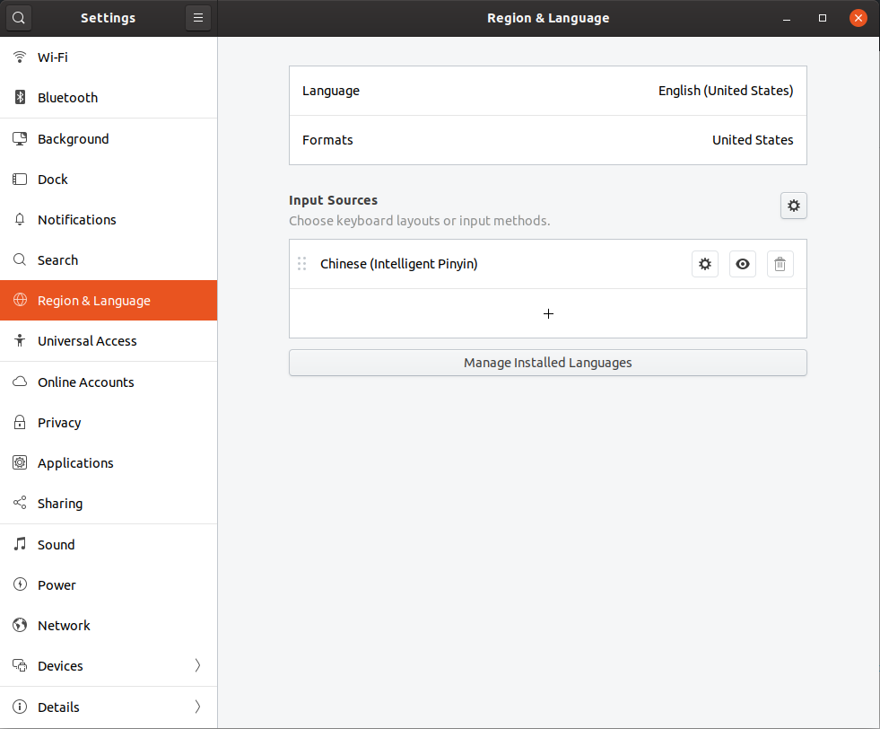
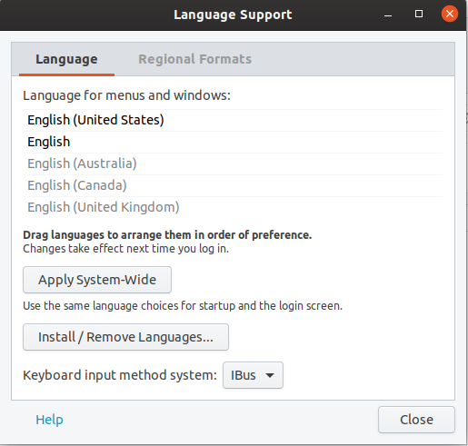
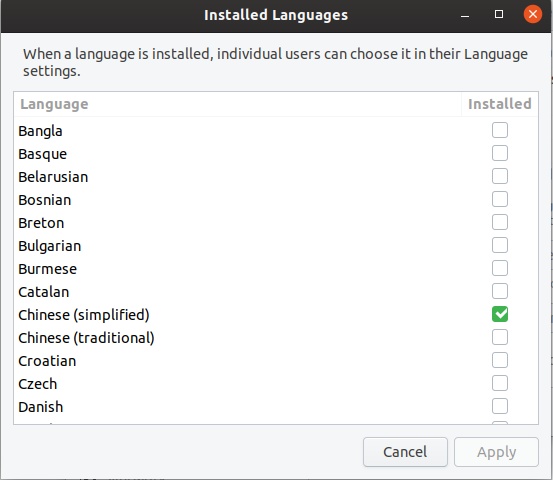
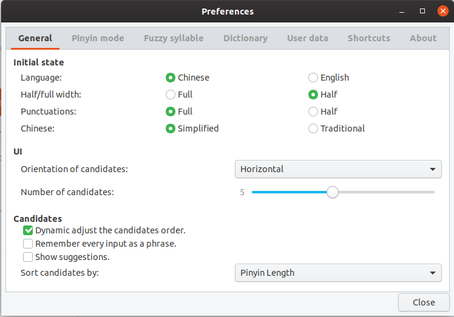

# Chinese_input_ibus_Ubuntu
Guide to install Chinese input with ibus in Ubuntu

## 1.Open *Settiing* Tab and Enter "Manage Installed Languages"

## 2.Install and Manage Languages

<1> Change ***"Keyboard input method system"*** to **`IBus`**

<2> Enter ***"Install/Remove Languages...."***

<3> Install ***"Chinese (simplified)"***

<4> Back to ***"Settings"*** tab

<5> Add ***"Chinese (Intelligent Pinyin)"*** and Remove all others **Input Sources**

<6> **`reboot`** system

<7> (Optional) Configure Input Preference

Tips: convert Chinese between **`Simplified`** and **`Traditional`**

